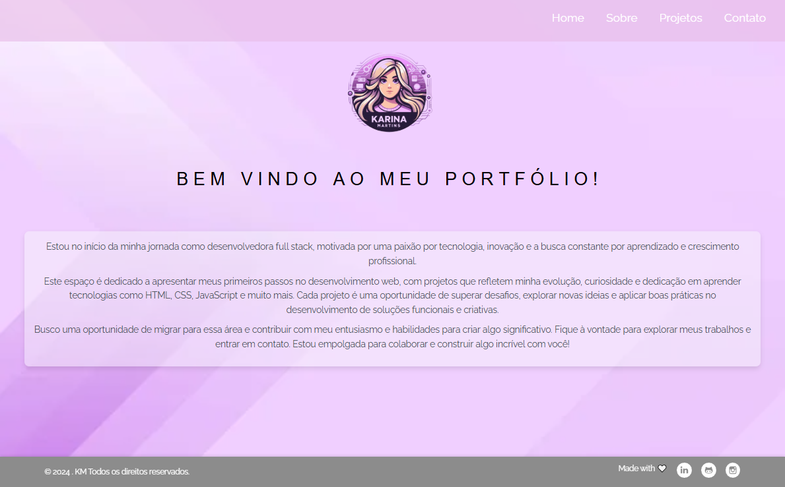

# Portfólio Pessoal 

###  MY Portfolio: 

Seja muito bem-vindo ao meu portfólio pessoal! Este projeto foi desenvolvido como parte do programa **"Além do Próximo Passo"** da empresa em que trabalho. Já estava pensando em criar esse portfólio há algum tempo, e esse programa foi a motivação perfeita para iniciar o desenvolvimento.

## 🎯 Objetivo

O objetivo deste projeto é demonstrar minhas habilidades como desenvolvedora em um contexto prático e real, alinhando-o aos requisitos e desafios propostos no programa **"Além do Próximo Passo"**, promovido pela empresa em que trabalho. Esse programa incentivou não apenas a criação de um portfólio, mas também a exploração de novas abordagens, técnicas e boas práticas que refletem meu compromisso com a melhoria contínua e o desenvolvimento de soluções eficientes e inovadoras.

Além disso, esse portfólio funciona como uma vitrine para minha trajetória de aprendizado, onde apresento projetos que simbolizam meu progresso no campo da tecnologia e o que venho aperfeiçoando ao longo do tempo. Ele serve para exibir tanto minhas competências técnicas quanto o meu olhar crítico sobre usabilidade, acessibilidade e design responsivo, todos fundamentais no desenvolvimento de interfaces modernas.

Por fim, o projeto reflete meu interesse em continuar evoluindo como profissional, seja através de práticas autodidatas, seja por meio de iniciativas promovidas pela empresa. Este portfólio também é uma oportunidade de compartilhar minha jornada com colegas, mentores e potenciais clientes, mostrando como o conhecimento adquirido é aplicado na prática e como estou preparada para os desafios do desenvolvimento web.

## 📖 Descrição do Projeto 

Este portfólio foi construído como um site estático utilizando HTML e CSS, com foco em usabilidade e design responsivo. A estrutura do site foi projetada para oferecer uma navegação intuitiva e organizada, destacando minhas habilidades e experiências profissionais de forma clara e acessível. 

Durante o desenvolvimento, tomei cuidado para garantir que o layout fosse adaptável a diferentes dispositivos, proporcionando uma experiência consistente tanto em desktops quanto em dispositivos móveis. Para isso, utilizei práticas modernas de CSS, como media queries e flexbox, que permitiram ajustar o design conforme a resolução da tela, mantendo a estética e a funcionalidade.

O portfólio apresenta seções dedicadas ao meu perfil, projetos e formas de contato, cuidadosamente estruturadas para transmitir informações de forma clara e objetiva, com foco na organização e na clareza visual. A página de contato conta com um **formulário personalizado** desenvolvido com MailJS, permitindo o envio de mensagens diretamente pelo site. Além disso, inclui um **botão animado** que direciona os visitantes para o WhatsApp, tornando a interação mais ágil e prática. Também disponibilizei meu [currículo em PDF](assets/file/curriculo-karina.pdf) para quem desejar consultar.

Todo o projeto reflete meu compromisso com boas práticas de desenvolvimento web, como o uso de uma estrutura semântica de HTML e o cuidado com a acessibilidade, assegurando que o site seja utilizável por todas as pessoas.

## 🛠️ Tecnologias Utilizadas 

- **HTML5**: Para a estruturação do conteúdo.
- **CSS3**: Para estilização e design responsivo.
- **JavaScript**: Para adicionar interatividade e funcionalidades dinâmicas.

## 📄 Descrição das Páginas 

- **`index.html`**: Página inicial do portfólio.  
- **`about.html`**: Seção sobre mim.  
- **`projects.html`**: Galeria de projetos com carrossel dinâmico.  
- **`certificates.html`**: Galeria de certificados dinâmica, com filtros e integrada a uma API. 
- **`contact.html`**: Criado um formulário funcional utilizando MailJS.  

## ⚙️ Funcionalidades 

- **Responsividade**: Layout adaptado para diferentes tamanhos de tela.  
- **Carrossel de Projetos**: Apresentação dinâmica de projetos com JavaScript.  
- **Botão "Voltar ao Topo"**: Facilita a navegação para o início da página.  
- **Foto de Perfil Dinâmica**: Troca ao passar o mouse, utilizando apenas CSS.  
- **Página de Certificados**: Adicionei uma nova seção para exibir meus certificados.
- **Formulário Personalizado**: Desenvolvi um formulário funcional utilizando MailJS. 

## 🤝 Contribuições

Contribuições são bem-vindas! Para contribuir:

- **Abra uma Issue:** Relate um bug ou sugira uma melhoria.
- **Crie um Pull Request:** Faça alterações no código e envie uma solicitação para revisão.

## 📧 Contato

Para perguntas ou feedback, entre em contato:

- **E-mail:** [nina.kastro@icloud.com](mailto:nina.kastro@icloud.com)
- **LinkedIn:** [LinkedIn](https://www.linkedin.com/in/karinacmartins/)
- **GitHub:** [GitHub](https://github.com/karinacmartins)

## Observações

- O projeto está em constante evolução, com atualizações e novas funcionalidades sendo implementadas à medida que avanço no meu aprendizado e na aplicação de novas tecnologias.

 
 

  
Made with 💜 by <a href="https://github.com/karinacmartins">KM</a>.

